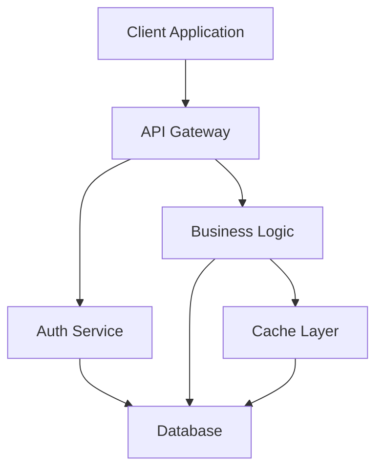
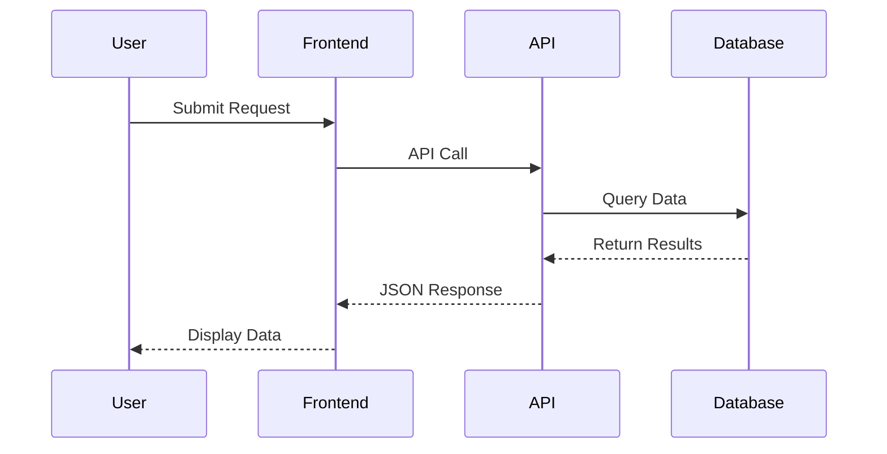
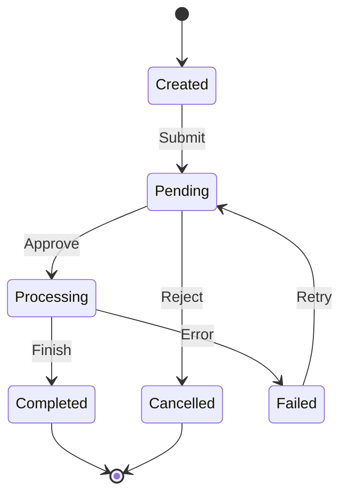

# Technical Documentation Example

This is a sample document demonstrating the conversion from Markdown to Typst.

## Introduction

This document showcases various **Markdown features** that are supported by `mdtype`. The converter handles:

- CommonMark basics
- GitHub Flavored Markdown (GFM)
- Mathematical equations
- Mermaid diagrams

## Text Formatting

You can use **bold text**, _italic text_, ~~strikethrough~~, and `inline code` throughout your document.

### Lists

Unordered list:
- Item one
- Item two
  - Nested item
  - Another nested item
- Item three

Ordered list:
1. First step
2. Second step
3. Third step

Task list:
- [x] Completed task
- [ ] Pending task
- [ ] Another pending task

## Code Examples

Here's a JavaScript code block:

```javascript
function fibonacci(n) {
  if (n <= 1) return n;
  return fibonacci(n - 1) + fibonacci(n - 2);
}

console.log(fibonacci(10));
```

Python example:

```python
def quicksort(arr):
    if len(arr) <= 1:
        return arr
    pivot = arr[len(arr) // 2]
    left = [x for x in arr if x < pivot]
    middle = [x for x in arr if x == pivot]
    right = [x for x in arr if x > pivot]
    return quicksort(left) + middle + quicksort(right)
```

## System Architecture

The following diagram illustrates the system architecture:



## Data Flow

Here's how data flows through the system:



## State Machine

The order processing state machine:



## Mathematical Formulas

### Inline Math

The equation $E = mc^2$ represents mass-energy equivalence.

The quadratic formula is $x = \frac{-b \pm \sqrt{b^2 - 4ac}}{2a}$.

### Display Math

The Gaussian integral:

$$
\int_{-\infty}^{\infty} e^{-x^2} dx = \sqrt{\pi}
$$

Taylor series expansion:

$$
f(x) = f(a) + \frac{f'(a)}{1!}(x-a) + \frac{f''(a)}{2!}(x-a)^2 + \frac{f'''(a)}{3!}(x-a)^3 + \cdots
$$

## Tables

Here's a comparison table:

| Feature | Markdown | Typst | LaTeX |
|---------|----------|-------|-------|
| Learning Curve | Easy | Medium | Hard |
| Compilation Speed | N/A | Fast | Slow |
| Output Quality | Basic | High | High |
| Diagrams | Limited | Good | Excellent |

Performance metrics:

| Operation | Time (ms) | Memory (MB) | Status |
|-----------|-----------|-------------|--------|
| Parse | 12 | 45 | ✓ |
| Render | 156 | 128 | ✓ |
| Convert | 8 | 32 | ✓ |

## Links and References

- [Typst Documentation](https://typst.app/docs)
- [Mermaid Syntax](https://mermaid.js.org/)
- [Markdown Guide](https://www.markdownguide.org/)

## Blockquotes

> This is a blockquote. It can contain multiple paragraphs and other markdown elements.
>
> It's useful for highlighting important information or quotes.

## Conclusion

This example demonstrates the rich feature set supported by `mdtype`. The converter handles most common Markdown elements and renders them appropriately in Typst format.

---

For more information, see the [project documentation](https://github.com/example/mdtype).
