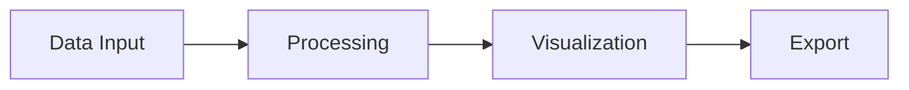

# User Guide

Welcome to our comprehensive user guide. This document demonstrates numbered headings and table of contents features.

<!-- toc -->

# Introduction

This guide covers all aspects of using our software platform effectively.

## Getting Started

Follow these steps to begin your journey with our platform.

### Installation

The installation process is straightforward and takes only a few minutes.

#### System Requirements

Before installing, ensure your system meets these requirements:

- Operating System: Windows 10+, macOS 11+, or Linux
- RAM: 4GB minimum, 8GB recommended
- Disk Space: 500MB free space

#### Download and Install

1. Visit our downloads page
2. Select your operating system
3. Run the installer
4. Follow the on-screen instructions

### Initial Configuration

After installation, you'll need to configure basic settings.

#### User Profile

Set up your user profile with the following information:
- Username
- Email address
- Password (minimum 8 characters)

#### Preferences

Customize your experience by setting preferences for:
- Theme (light/dark mode)
- Notifications
- Language

## Core Features

Our platform offers a comprehensive set of features designed for productivity.

### Document Management

Organize and manage your documents efficiently.

#### Creating Documents

Create new documents using templates or start from scratch:

```markdown
# My Document
This is a sample document.
```

#### Organizing with Folders

Use folders to keep your workspace organized:
- Personal documents
- Work projects
- Shared files

### Collaboration Tools

Work together with your team seamlessly.

#### Real-time Editing

Multiple users can edit documents simultaneously with:
- Live cursor tracking
- Instant updates
- Change highlighting

#### Comments and Reviews

Provide feedback using our commenting system.

### Data Visualization

Create stunning visualizations from your data.

#### Charts and Graphs

The system supports various chart types:



#### Interactive Dashboards

Build custom dashboards with drag-and-drop widgets.

## Advanced Topics

Dive deeper into advanced functionality.

### API Integration

Integrate with external services using our REST API.

#### Authentication

Authenticate API requests using OAuth 2.0:

```javascript
const token = await getAuthToken(apiKey, apiSecret);
fetch('/api/resource', {
  headers: { 'Authorization': `Bearer ${token}` }
});
```

#### Rate Limits

API calls are limited to prevent abuse:

| Plan | Requests/Hour | Burst Limit |
|------|---------------|-------------|
| Free | 100 | 10 |
| Pro | 1,000 | 50 |
| Enterprise | 10,000 | 200 |

### Automation

Automate repetitive tasks with workflows.

#### Creating Workflows

Define workflow steps:
1. Trigger event
2. Conditions
3. Actions
4. Notifications

#### Scheduling

Schedule workflows to run at specific times or intervals.

## Security

Security is our top priority.

### Data Encryption

All data is encrypted both in transit and at rest.

#### Transport Security

- TLS 1.3 for all connections
- Certificate pinning
- HSTS enabled

#### Storage Security

Data at rest is encrypted using AES-256:

$$
C = E(K, P)
$$

Where $C$ is ciphertext, $K$ is the key, and $P$ is plaintext.

### Access Control

Manage permissions with role-based access control (RBAC).

#### User Roles

Available roles:
- **Admin**: Full system access
- **Editor**: Can create and modify content
- **Viewer**: Read-only access

#### Permissions

Fine-grained permissions control access to specific features.

## Troubleshooting

Common issues and their solutions.

### Connection Problems

If you experience connection issues:

1. Check your internet connection
2. Verify firewall settings
3. Clear browser cache
4. Contact support if issues persist

### Performance Issues

To improve performance:

- Close unused tabs
- Clear application cache
- Disable unnecessary extensions
- Upgrade your plan for more resources

### Data Recovery

In case of data loss:

1. Check the trash/recycle bin
2. Review version history
3. Contact support for backup restoration

## Conclusion

Thank you for choosing our platform. For additional help, visit our support portal or contact our team.

### Additional Resources

- [Knowledge Base](https://help.example.com)
- [Community Forum](https://community.example.com)
- [Video Tutorials](https://tutorials.example.com)

### Contact Support

Reach our support team:
- Email: support@example.com
- Phone: 1-800-SUPPORT
- Live Chat: Available 24/7
